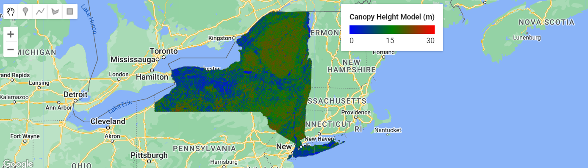

# Canopy Height Modeling using GEDI and Sentinel-2 in Google Earth Engine

This project uses **Google Earth Engine (GEE)** to model forest canopy height by integrating **GEDI (Global Ecosystem Dynamics Investigation) L2A** elevation metrics with **Sentinel-2** bands and vegetation indices. The final model predicts canopy height (`rh95`) using a **Random Forest regression model**.

---

## Data Sources

- **GEDI L2A Monthly (LARSE/GEDI/GEDI02_A_002_MONTHLY)**  
  Used for reference canopy height (`rh95`). Data is filtered using quality flags (`quality_flag == 1` and `degrade_flag == 0`).

- **Sentinel-2 (Custom Stacked Image)**  
  Median composite for June–September 2019, including bands B2, B3, B4, B5, B7, B8, B11, B12 and vegetation indices (NDVI, NBR, NDMI).

- **Feature Collections:**  
  - `table` – Region of interest (polygon boundary)  

---

## Processing Steps

1. **Data Preparation**
   - Load and clip Sentinel-2 composite and GEDI collection to ROI.
   - Mask GEDI data for quality and degradation flags.

2. **Vegetation Indices**
   - Compute NDVI, NBR, and NDMI from Sentinel-2 bands.

3. **Stacking Inputs**
   - Combine vegetation indices with original Sentinel-2 bands.
   - Sample GEDI `rh95` and associate with stacked image bands.

4. **Train-Test Split**
   - Filter out GEDI points with null `rh95`.
   - Apply a random column to split ~70% training and 30% testing samples.

5. **Model Training**
   - Use `smileRandomForest` regression with:
     - Trees: 74
     - Min Leaf Population: 3
     - Bag Fraction: 1
     - Seed: 123
   - Train on bands:  
     `B2_median, B3_median, B4_median, B5_median, B7_median, B8_median, B11_median, B12_median, ndvi, nbr, ndmi`
   - **Note:** These hyperparameters are fixed for this workflow. A full grid search could potentially improve model performance, but it is computationally intensive and beyond the scope of this project.

6. **Prediction and Visualization**
   - Apply trained model to the stacked image.
   - Display the Canopy Height Model (CHM) with legend.
   - Export predicted CHM raster and evaluation samples to Google Drive.

---

## Exports

| Export Name | Type | Description |
|-------------|------|-------------|
| `gedi_training_samples_NY_2019` | CSV / Shapefile | Training samples for Random Forest |
| `gedi_testing_samples_NY_2019` | CSV / Shapefile | Testing samples for evaluation |
| `CHM_RF_NY_2019` | GeoTIFF | Predicted Canopy Height Model |
| `S2CHM_RF_NY_2019_eval` | CSV | Evaluation points with predicted vs. observed `rh95` |

---

## How to Run

1. Import the script into **Google Earth Engine**.
2. Ensure all assets (Sentinel-2 composite, ROI) exist in your account.
3. Run the script step by step in the GEE code editor.
4. Exported data will appear in your Google Drive folder `GEE_outputs`.

---

## Example Output

  
*Predicted canopy height (`rh95`) map using Random Forest regression.*

---

## Notes

- This code assumes all referenced assets are already uploaded to your GEE account.  
- The region of interest (`table`) must be uploaded as a valid polygon feature in your GEE Assets.  
- Ensure `rh95` is non-null for training samples.  
- The final CHM raster is exported at **10 m resolution**, even though GEDI foot print is 25 m.  

---

## References

- Rouse, J. W., Haas, R. H., Schell, J. A., & Deering, D. W. (1974). *Monitoring vegetation systems in the Great Plains with ERTS.* NASA SP-351, 309–317.  
- Gao, B. C. (1996). *NDWI—A normalized difference water index for remote sensing of vegetation liquid water from space.* Remote Sensing of Environment, 58(3), 257–266. [https://doi.org/10.1016/S0034-4257(96)00067-3](https://doi.org/10.1016/S0034-4257(96)00067-3)  
- Key, C. H., & Benson, N. C. (2006). *Landscape assessment: Ground measure of severity, the Composite Burn Index, and remote sensing of severity, the Normalized Burn Ratio.* In *FIREMON: Fire effects monitoring and inventory system* (Gen. Tech. Rep. RMRS-GTR-164-CD: LA1–LA51). USDA Forest Service.  
- Gorelick, N., Hancher, M., Dixon, M., Ilyushchenko, S., Thau, D., & Moore, R. (2017). *Google Earth Engine: Planetary-scale geospatial analysis for everyone.* Remote Sensing of Environment, 202, 18–27. [https://doi.org/10.1016/j.rse.2017.06.031](https://doi.org/10.1016/j.rse.2017.06.031)  
- Dubayah, R., et al. (2020). *The Global Ecosystem Dynamics Investigation: High-resolution laser ranging of the Earth’s forests and topography.* Science of Remote Sensing, 1, 100002. [https://doi.org/10.1016/j.srs.2020.100002](https://doi.org/10.1016/j.srs.2020.100002)  
- Breiman, L. (2001). *Random forests.* Machine Learning, 45(1), 5–32. [https://doi.org/10.1023/A:1010933404324](https://doi.org/10.1023/A:1010933404324)

---

## Author

[@htamiminia](https://github.com/htamiminia)

---

## License

MIT License – you may use, modify, and distribute with attribution. See the [LICENSE](LICENSE) file for details.
